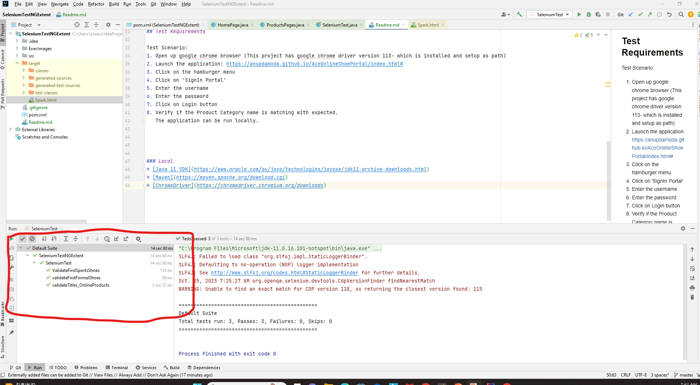
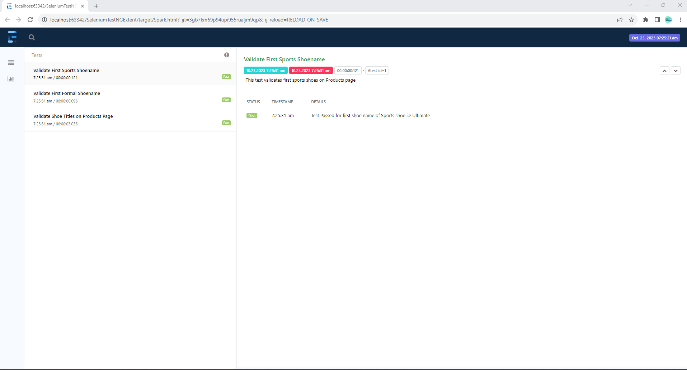
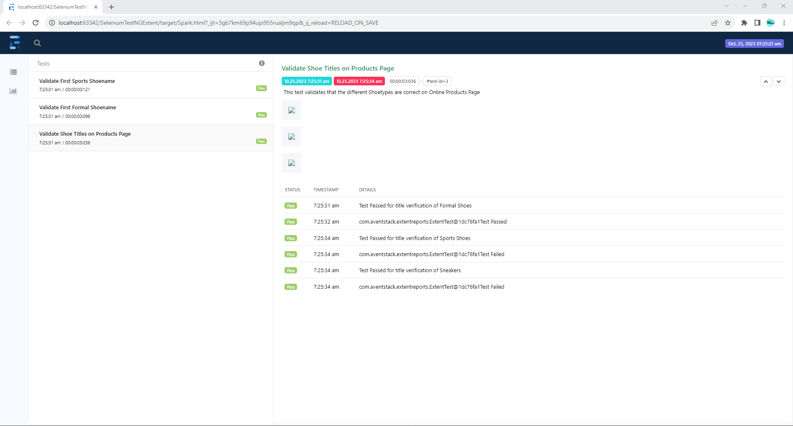

<h1 align="center"> Selenium Code - Java (Testng with chrome driver setup - 3 tests peformed on sample application) - with Extent Reporting </h1>  

  Description. : This is a demo testcase on java tech with testng and selenium test.
 There are 3 tests performrf on the sample application: https://anupdamoda.github.io/AceOnlineShoePortal/index.html

## Table of Contents

- [Introduction](#introduction)
- [Features](#features)
- [Requirements](#requirements)
- [Quick Start](#quick-start)

## Introduction
This is a demo testcase on java tech with testng and selenium test - this framework uses extent reporting for better viewing of the results.
There are 3 tests  sample application: https://anupdamoda.github.io/AceOnlineShoePortal/index.html
1st test: Validate the first formal shoes is appearing as 'Classic Cheltanham' on the Products Page
2nd test: Validate the first sports shoes is appearing as 'Ultimate' on the Products Page
3rd test: Validate the Title of the products page.

## Features
Selenium Tests

## Test Requirements

Test Scenario:
1. Open up google chrome browser (This project has google chrome driver version 113- which is installed and setup as path)
2. Launch the application: https://anupdamoda.github.io/AceOnlineShoePortal/index.html#
3. Click on the hamburger menu
4. Click on 'SignIn Portal'
5. Enter the username
6. Enter the password
7. Click on Login button
8. Verify if the Product Category name is matching with expected.
   The application can be run locally.

### Local
* [Java 11 SDK](https://www.oracle.com/au/java/technologies/javase/jdk11-archive-downloads.html)
* [Maven](https://maven.apache.org/download.cgi)
* [ChromeDriver](https://chromedriver.chromium.org/downloads) 

